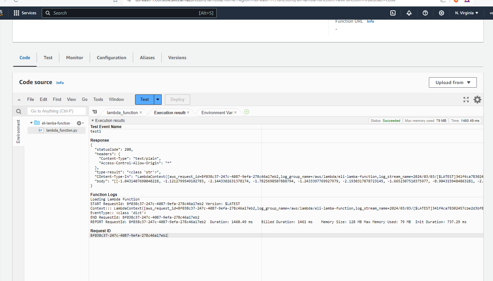
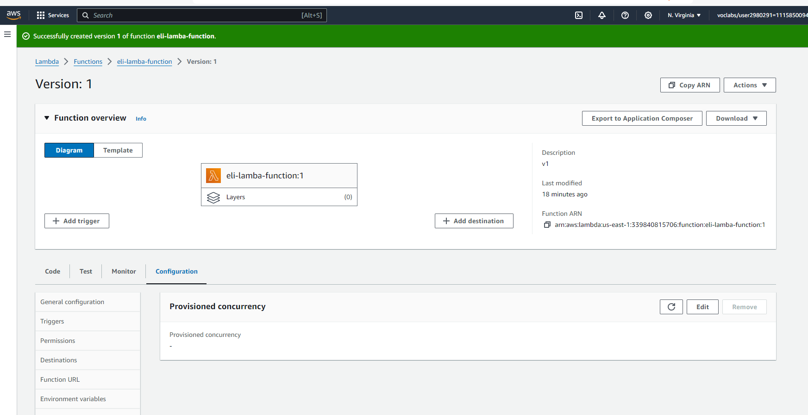

## Writeup

Computer Vision project: recognize types of dogs from images of dogs


Goal: Operationalize the project so it's ready to be deployed live in a real world application

Maxmize project speed and minimize cost
Setup a Lambda function
Resolve a security issue and check for security issues
distributed training
concurrency and autoscaling


The major steps of the project include

Deploy appropriate instances that allow you to maximize your projects’ speed and minimize costs.
Set up a Lambda function so the project can provide outputs to users.
Resolve a security issue related to your Lambda function, and check for other security issues.
Set up your model training so it can train on multiple instances simultaneously.
Set up concurrency and autoscaling for your project so it can manage high throughput with low latency.


## Step 1 : Training and deployment on Sagemaker

create and open a Sagemaker instance. For this project, X instance was chosen because it is a powerful GPU which had previously been granted access by AWS.


## Step 2: EC2 Training


open the TrainedModels directory on your EC2 instance and take a screenshot of the model that has been saved in it, to provide evidence that you completed this step


https://knowledge.udacity.com/questions/924507

GPU based instance types such as p3 are the ideal ones, but have limits on the student accounts. It will work on t3.medium but the training will be very slow.

"Decide the type of instance you want, create it in your workspace, and write a justification of why you chose the instance type you did."

A:  t3.medium, Deep Learning AMI Neuron (Ubuntu 22.04) 

```
wget https://s3-us-west-1.amazonaws.com/udacity-aind/dog-project/dogImages.zip
unzip dogImages.zip
```

```
mkdir TrainedModels
```

```
vim solution.py
```

```
:set paste
```


## Step 3: Lambda function setup

The previously trained model and its inferences on the endpoint XXX are invoked by a lambda function.


### Lambda test

```
{
  "url": "https://s3.amazonaws.com/cdn-origin-etr.akc.org/wp-content/uploads/2017/11/20113314/Carolina-Dog-standing-outdoors.jpg"
}

```


### Lambda security

The lambda function is setup with two security policies:
1. Basic Lambda Function Execution
2. Amazon SageMaker Full Access


Prior to granting the security access the following authentication error was returned.

However it is important to acknowledge that this approach violates the principle of least privilege.
Ideally the minimium level of access should be granted to the specific roles.


Write at least 1 paragraph describing how this function is written and how it works.

Configured a Lambda function to invoke the deployed endpoint. The lambda function has the 
appropriate security policy to allow the lambda function to access all of the Sagemaker endpoints.


Q: you should notice how it invokes the endpoint (with the invoke_endpoint() method) and how it sets up the return statement. Write at least 1 paragraph describing how this function is written and how it works.

A: 







 "body": "[[-1.8396921157836914, -1.729576587677002, -2.351572275161743, -1.8032201528549194, -1.0459089279174805, -1.2822874784469604, -2.1463654041290283, -2.363435983657837, -2.8685805797576904, -2.1831648349761963, -1.9547674655914307, -1.5344465970993042, -2.2659785747528076, -1.9723678827285767, -0.7522351145744324, -2.2238306999206543, -1.5340739488601685, -1.4611005783081055, -1.9439642429351807, -1.6199285984039307, -0.9383322596549988, -1.9409263134002686, -1.4518369436264038, -1.5060937404632568, -2.071455240249634, -2.432358503341675, -1.4646046161651611, -2.696411371231079, -1.6498212814331055, -1.376001000404358, -2.569312810897827, -1.5519828796386719, -2.34116268157959, -2.026864767074585, -1.7309778928756714, -1.3407113552093506, -2.2783379554748535, -1.8847801685333252, -1.7782297134399414, -1.301297903060913, -1.4316320419311523, -1.724945306777954, -1.6760207414627075, -1.7200671434402466, -2.7910892963409424, -2.1962080001831055, -2.2942843437194824, -1.6930617094039917, -1.8487008810043335, -2.4495675563812256, -1.3379759788513184, -1.8369765281677246, -2.2110249996185303, -1.30440354347229, -1.7210474014282227, -2.113964557647705, -2.232828140258789, -3.0785346031188965, -2.1136367321014404, -1.6890636682510376, -1.766321063041687, -2.1494860649108887, -1.5624748468399048, -2.108995199203491, -2.4104888439178467, -3.1343021392822266, -2.802445888519287, -2.556227684020996, -2.556694746017456, -2.9037575721740723, -2.7740910053253174, -1.4093066453933716, -2.1806581020355225, -2.1245179176330566, -1.6361390352249146, -1.6968810558319092, -2.8768255710601807, -2.469417095184326, -2.2665607929229736, -2.1961519718170166, -2.024289131164551, -1.1954894065856934, -1.6286098957061768, -2.408987283706665, -3.106236219406128, -2.0772876739501953, -1.0226078033447266, -2.432098627090454, -1.8055413961410522, -1.2120792865753174, -1.895389199256897, -1.7455693483352661, -2.9728219509124756, -1.5951027870178223, -1.7526476383209229, -2.490340232849121, -1.8301836252212524, -1.3261065483093262, -2.2117116451263428, -1.4346829652786255, -2.701876163482666, -2.84710431098938, -2.41389799118042, -2.754962682723999, -2.653604507446289, -2.3865513801574707, -2.0332999229431152, -2.530456781387329, -2.267566680908203, -2.1750810146331787, -2.117199659347534, -1.8439046144485474, -1.7356665134429932, -1.487554669380188, -1.7178053855895996, -2.640857219696045, -1.9451109170913696, -1.8740174770355225, -2.3417015075683594, -1.848230004310608, -2.0563161373138428, -2.1128089427948, -1.4506148099899292, -2.5194015502929688, -2.8195667266845703, -2.412748098373413, -2.663094997406006, -2.274240016937256, -2.306858539581299, -1.859210729598999, -2.2136740684509277, -2.21923565864563, -2.7308828830718994]]"
}
## Step 4: Security and testing


## Step 5: Concurrency and auto-scaling

The purpose of concurrency on the lambda function is to accomodate high traffic because it will enable 
the function to respond to more than one invocation at once.

https://stackoverflow.com/questions/70279196/why-is-configure-autoscaling-greyed-out-on-sagemaker


